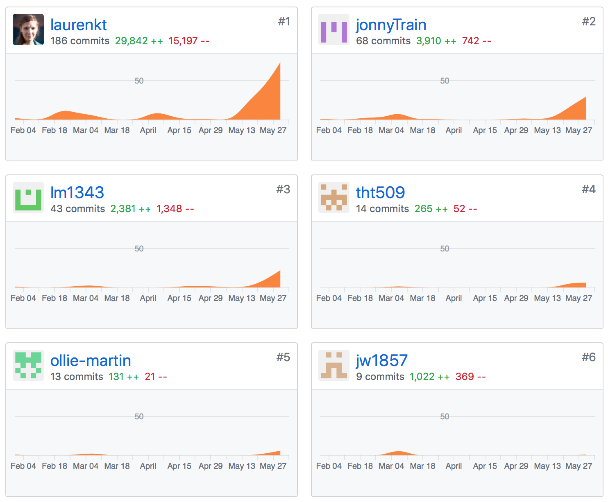
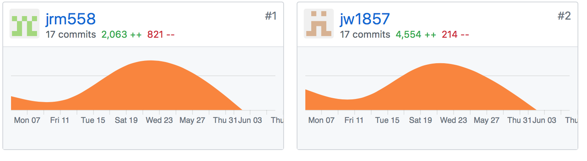

The course code is set-up into two repositories:
 
- `unlockyork` which contains the Kiosk code (`src/` dir), HTML tour (`tour/`), and content (`content/`). There is also an older version of the Android source code in `app/` but this is not up-to-date with the latest in the Android repository.
- `unlock_android` which contains the Android source code.

These are git repositories hosted on our team GitHubs at:

- https://github.com/laurenkt/unlockyork
- https://github.com/jw1857/unlock_android

The PWS GitHub is available at https://github.com/JackoRo/SWEngPWS

The commit statistics from the two GitHub repositories are reproduced below. Note these are not a foolproof method of verifying activity as many times people worked in pair programming at others computers, but it does give some indication.

